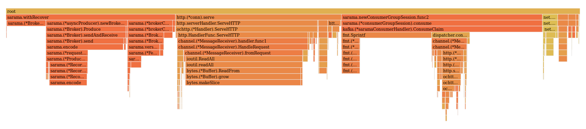

# Test run 11-14-2019

## Environment

Bare metal cluster with three Dell PowerEdge R6415, CPU AMD EPYC 7401P 24-Core Processor, 24Gb memory.

Deployments on nodes:

* Node1: Knative Eventing SUTs (IMC dispatcher, Kafka Dispatcher, Kafka Source deployments) + etcd + master kube node (apiserver, controller, etc)
* Node2: Kafka Cluster & Zookeeper (deployed as single replica ephemeral cluster)
* Node3: Test sender and receiver, deployed in two different pods

Servers are on the same rack and are connected with 1Gb Ethernet. 940Mbit/s is the thpt between machines (iperf)

Kubernetes v1.15.6 running in Fedora 29, using Docker container engine, flannel networking and iptables kube-proxy mode

## Test

Sender and Receiver are deployed in two different pods on the same node.

GC is **on** in the receiver pod, while GC runs *only* between paces in the sender pod. No GC message is sent between paces.

Kafka topics used in channel-kafka, broker-kafka and source-kafka have 100 partitions and 1 replication factor.

Payloads of the messages are 8192 bytes long, and no supplemental headers are sent other than the required ones.

Two different pace configurations are tested:

* 1k-2k: `1000:30,1100:30,1200:30,1300:30,1400:30,1500:30,100:60,1600:30,1700:30,1800:30,1900:30,2000:30`. The test incrementally increase the load from 1000 to 2000 rps with steps of 100 rps for 30 seconds
* 1k-long: `1000:360` (only channel-imc, broker-imc, channel-kafka, broker-kafka). The SUTs (System Under Tests) are stressed at 1000 rps for 360 seconds

The first one should prove the breaking points of the SUT, while the second one should help finding an e2e latency measurement at 1000 rps.
The latencies on the first configuration should not be used to analyze the latency of the SUT itself, since it can lead to wrong conclusions.
In the second configuration the latency to be considered is the last one at right of the graph (the end of the line)

For an overview about metrics used in the tests, look at https://github.com/knative/eventing/blob/master/test/test_images/performance/README.md

After each test run, both the Eventing data-plane and Kafka/Zookeeper pods are destroyed and recreated,
to ensure the test uses a fresh instance of the SUTs and not a degraded one by the previous test.
SUTs are not warmupped in any way and warmup is deactived in the test image

## Results

All latency shown below are percentiles 99.99% (calculated with T-Digest).

The graph shows 6 metrics:

* P99.99 Publish latency
* P99.99 End to End latency
* Send throughput
* Delivery throughput
* Send failures throughput
* Delivery failures throughput (lost messages)

You can plot by yourself the results using gnuplot and the scripts provided at root of this repository.
With gnuplot visualization you can zoom in particular regions of the graph, giving you a better view of the data.

Note:

* `run-1-1k-2k` results can be misleading, since in this particular run the eventing data-plane pods weren't destroyed between tests
* Send throughput shows the effective load the test image can deliver, so this value should match the pace configuration. After the breaking point of the SUTs, the test image could be slowed down by the SUTs itself ([coordinated omission](http://highscalability.com/blog/2015/10/5/your-load-generator-is-probably-lying-to-you-take-the-red-pi.html)). This probably happens because too much requests are waiting for response and Go runtime can't manage to efficiently create new goroutines to generate the load
* Those results should not be considered final and exact, but they should be used as a landmark for future improvements in Knative Eventing
* Carefully look at the scale of the graphs, since each graph has potentially a different scale to adapt to the image resolution

### Direct

The direct test acts as baseline to understand if the test sender and receiver can generate and hold the load we want to test.

Results from all runs shows that the test image can hold the load (in `run-4-1k-2k` and `run-5-1k-2k` it was omitted)

Note:

In direct test the publish latency is higher than the e2e latency because of how it's calculated.

### IMC Channel

All 1k-2k run configurations shows that IMC channel can hold stable the increasing load up to the maximum.

run-3-1k-2k

run-5-1k-2k

At the beginning of each test in 1k-2k configuration, there is a huge spike for e2e latency (probably because of the cold start):

Data points zoom of beginning of run-2-1k-long

Both 1k-long results proves that imc-channel manages to have a p99.99 e2e latency between 20-30ms:

run-1-1k-long

run-2-1k-long

The reason because the publish latency percentile is higher than the e2e one is probably because there was a coordination problem between sender and receiver that led the sender to send before the receiver was ready to receive.
This led to register a high spike at the beginning of the test, like shown in the graph below:

Data points of run-2-1k-long

I've removed the initial points of the test from the dataset, and the result is that publish latency floats around 15 to 20 ms:

run-1-1k-long sanitized

run-2-1k-long sanitized

Future runs of this test should take this problem into account

### IMC Broker

run-3-1k-2k and run-4-1k-2k shows the breaking point as 1900 rps:

run-3-1k-2k

run-4-1k-2k

While in run-2-1k-2k the breaking point is 2000 rps

run-2-1k-2k

Zoom on the breaking point shows that the final messages of 1900 rps pace are dropped and lost and both at 1900 rps and 2000 rps the sender starts to fail

Zoom on 1900 rps and 2000 rps pace in run-4-1k-2k

The data points shows that both publish and e2e latency start to degrade (note the different scale of latency axis):

Zoom on 1900 rps rps pace in run-4-1k-2k

Both run-1-1k-long & run-2-1k-long shows that the publish p99.99 latency is ~17/18ms and e2e p99.99 latency around ~25ms, but slowly diverging while the test is running:

run-1-1k-long

run-2-1k-long

### Kafka Channel

run-2-1k-2k and run-3-1k-2k shows the breaking point as 1300 rps, while for run-4-1k-2k and run-5-1k-2k the breaking point is 1400 rps:

run-2-1k-2k

run-3-1k-2k

run-4-1k-2k

run-5-1k-2k

Both run-1-1k-long & run-2-1k-long were influenced by the absence of a warmup phase, so the percentiles includes the huge spikes at the beginning of the test caused by the warmup of SUTs' JVM:

run-1-1k-long with zoom at the beginning of the test

I've removed the initial data points and recalculated the percentiles to get a better estimate **after the SUT is warm**:

run-1-1k-long sanitized

run-2-1k-long sanitized

These results shows that the e2e latency is around 400 and 500 ms

Future runs of this test should take into account the problem of running some sort of warmup before the data point record begins. This should remove the initial spikes because of the cold Kafka & Zookeeper JVMs

### Kafka Broker

All 1k-2k runs shows that the Kafka broker can handle 1100 rps:

run-2-1k-2k

1k-long runs on Kafka broker returns meaningless results, since the SUT cannot hold the load for the required test time and a lot of messages are dropped along the way:

run-2-1k-long

### Kafka Source test

KafkaSource test results are quite suspicious:

run-2-1k-2k

Only a bunch of initial messages are received correctly, the others just remains enqueued before the test ends.

It looks like a lack of concurrency in request processing, but this is a too hazardous hypotesis.

Data points zoom on the initial part of run-2-1k-2k

Next runs should investigate further on this particular problem

## Profiling

In the profile directory you'll find some profiling data gathered while the system is stressed with 1000 rps.

### Kafka Channel

CPU time:

CPU flamegraph from pprof.channel_dispatcher.samples.cpu.002.pb.gz

KafkaChannel does GC for 29.71% of CPU time

Memory allocations space:

Memory flamegraph from pprof.channel_dispatcher.alloc_objects.alloc_space.inuse_objects.inuse_space.005.pb.gz

The big allocators are:

* ~22% `channel.(*MessageReceiver).fromRequest` uses `ioutil.ReadAll` that allocates a buffer big enough to host the request body. This could be fixed reusing the short lived buffers allocated. 
* ~35% `kafka.(*saramaConsumerHandler).ConsumeClaim` had a bad log line that allocates memory to log the whole event. This should be fixed in https://github.com/knative/eventing-contrib/pull/743
* ~29% sarama sender and receiver code that allocates memory to read/write/encode/decode on kafka wire.

### Kafka Source

CPU time:

CPU flamegraph from pprof.receive_adapter.samples.cpu.005.pb.gz

Looking at graph, memory allocation doesn't seem the biggest problem (gc worker uses ~7% of cpu time), however looking at top data, cumulated CPU time of mallocs is ~29% of CPU time.

Looking down the `adapter.(*Adapter).Handle.func1` function, most of time is spend in `client.(*ceClient).Send` (~5% of total CPU time).
The `client.(*ceClient).Send` method time is mostly dominated by `http.(*Codec).Encode`, which is dominated by `observability.NewReporter` and `observability.(*reporter).OK`.

Memory allocations space:

Memory flamegraph from pprof.receive_adapter.alloc_objects.alloc_space.inuse_objects.inuse_space.005.pb.gz

The big allocators are:

* ~40% sarama receiver
* ~16% `github.com/cloudevents/sdk-go/pkg/cloudevents/transport/http.(*Message).copyOut`: This method copies the whole event in a newly allocated buffer before sending it. https://github.com/cloudevents/sdk-go/issues/191#issuecomment-555113899